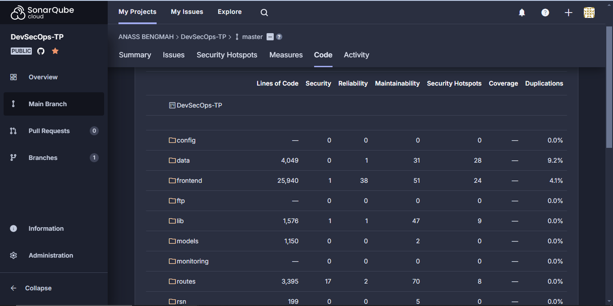
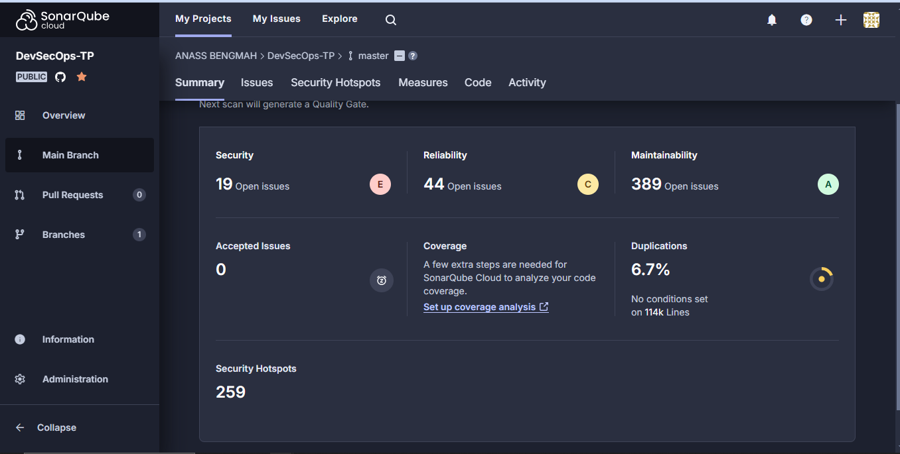
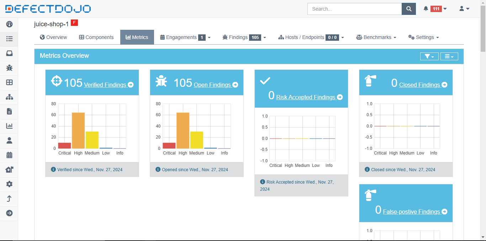
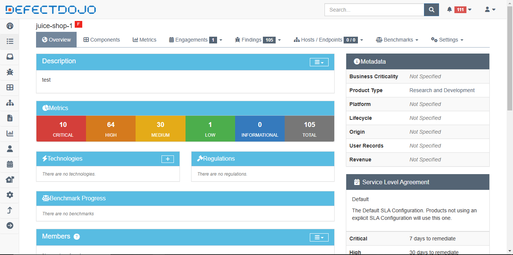
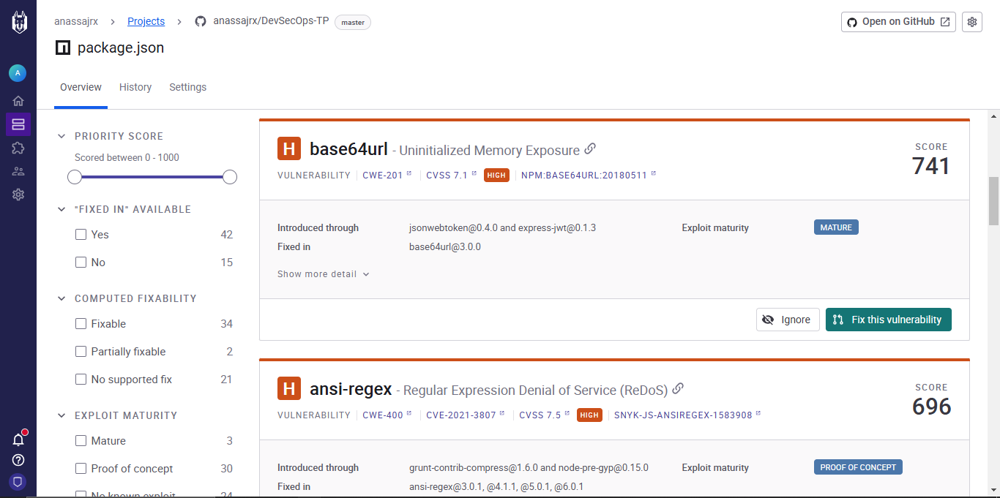
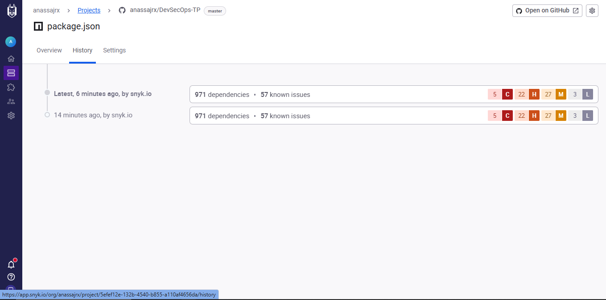

# OWASP Juice Shop CI/CD & DevSecOps Pipeline

## Project Overview

This project implements a **Continuous Integration (CI)** and **Continuous Deployment (CD)** pipeline for the **OWASP Juice Shop**, an intentionally insecure web application designed for security testing. The pipeline incorporates automated **security testing**, **vulnerability management**, and **automated redeployment** every time the source code is updated.

### Key Features:
- **CI/CD Pipeline**: Automated image retrieval, testing, and deployment.
- **Security Testing**:
  - **Static Application Security Testing (SAST)**: Conducted on the source code.
  - **Software Composition Analysis (SCA)**: Identifies vulnerabilities in application dependencies.
  - **Dynamic Application Security Testing (DAST)**: Scans the running application for runtime vulnerabilities.
- **Vulnerability Management**: Integrated tools like **SonarQube**, **DefectDojo**, and **Snyk** to track and visualize vulnerabilities.
- **Automated Redeployment**: Redeplying the app after each change and running security tests.

---

## Table of Contents
1. [CI Pipeline Setup](#ci-pipeline-setup)
2. [DevSecOps Security Testing](#devsecops-security-testing)
3. [Vulnerability Management and Visualization](#vulnerability-management-and-visualization)
4. [Automated Redeployment After Source Code Changes](#automated-redeployment-after-source-code-changes)
5. [Screenshots](#screenshots)
6. [Conclusion](#conclusion)

---

## CI Pipeline Setup

### Description
The CI/CD pipeline is set up using **GitHub Actions** to automate the process of retrieving the **OWASP Juice Shop Docker image** from Docker Hub, deploying it to a specific environment, and running automated tests.

### Pipeline Configuration
The pipeline is triggered on `push` and `pull_request` events for the `main` or `master` branches. It includes the following steps:
1. **Image Retrieval**: Pull the latest Docker image of Juice Shop from Docker Hub.
2. **Build & Deploy**: Rebuild the application and deploy it to a cloud server or a local environment.
3. **Run Security Tests**: Execute **SCA**, **SAST**, and **DAST** tests after deployment to identify vulnerabilities.

---

## DevSecOps Security Testing

### Description
The pipeline extends with automated **security testing** to ensure the application remains secure during development. This includes:

1. **Static Application Security Testing (SAST)**: Static analysis of the code base to find vulnerabilities before runtime.
2. **Software Composition Analysis (SCA)**: Identifies vulnerabilities in external dependencies used in the application.
3. **Dynamic Application Security Testing (DAST)**: Scans the live application for runtime vulnerabilities.

### SCA (Software Composition Analysis)
SCA is integrated using tools like **Snyk** to automatically scan the application's dependencies for known vulnerabilities.

```yaml
jobs:
  scan_sca:
    runs-on: ubuntu-latest
    steps:
      - name: Checkout code
        uses: actions/checkout@v3
      - name: Run SCA with Snyk
        run: snyk test --all-projects --severity-threshold=high --json > snyk-report.json
```

---

## Vulnerability Management and Visualization

### Description
The **Vulnerability Management** process includes integrating tools like **SonarQube**, **DefectDojo**, and **Snyk** to track, manage, and visualize security vulnerabilities. These tools help in providing clear overviews of identified vulnerabilities, their severity levels, and remediation recommendations.

### SonarQube
**SonarQube** is used to conduct **SAST** and provide a detailed summary of the code quality and vulnerabilities. It categorizes findings into critical, major, and minor vulnerabilities.

#### SonarQube Summary
Below is an example of the summary dashboard showing vulnerability distribution:




### DefectDojo
**DefectDojo** is used for vulnerability tracking and reporting. It consolidates results from various security tests (SAST, DAST, etc.) and provides metrics on vulnerabilities found.

#### DefectDojo Vulnerability Summary
The following images show a summary of vulnerabilities in DefectDojo:




#### DefectDojo Vulnerability Report
The **DefectDojo** report PDF below shows the findings of vulnerabilities detected during security testing:

[Download DefectDojo Vulnerability Report](report.pdf)

### Snyk Vulnerability Management
**Snyk** provides Software Composition Analysis (SCA) by identifying vulnerabilities in the application dependencies. This is part of the SCA step in the pipeline.

Below are screenshots from **Snyk** showing the detected vulnerabilities:




---

## Automated Redeployment After Source Code Changes

### Description
The pipeline is designed to automatically rebuild, redeploy, and re-test the application each time a source code change is committed. This ensures the application remains up-to-date and secure after every update.

1. **Changes in Code**: When frontend or backend changes are committed to the repository, the pipeline is triggered.
2. **Rebuild and Redeploy**: The application is rebuilt and redeployed in the test environment or production.
3. **Security Tests**: After redeployment, security tests (SCA, SAST, DAST) are re-run to check for any newly introduced vulnerabilities.

Example of the pipeline steps:

```yaml
jobs:
  deploy:
    runs-on: ubuntu-latest
    steps:
      - name: Checkout code
        uses: actions/checkout@v3
      - name: Build Docker image
        run: |
          docker build -t juicshop:latest .
      - name: Deploy to server
        run: |
          ssh -i ${{ secrets.SSH_PRIVATE_KEY }} user@server-ip "docker pull juicshop:latest && docker run -d -p 3000:3000 juicshop:latest"
```

---

## Screenshots

### Snyk Dashboard
Below are images of the **Snyk Dashboard**, showcasing the vulnerabilities found in dependencies:


### DefectDojo Dashboard and Metrics
Here are two images showing the vulnerability summary and metrics from **DefectDojo**:


### SonarQube Summary
Two images below represent the SonarQube vulnerability summary and metrics:


### DefectDojo Vulnerability Report
A **PDF report** of the vulnerabilities found by **DefectDojo** is available for download:

[Download DefectDojo Vulnerability Report](path_to_defectdojo_report.pdf)

---

## Conclusion

This project demonstrates the integration of CI/CD practices with **DevSecOps** principles, ensuring the OWASP Juice Shop application is built, tested, deployed, and continuously monitored for vulnerabilities. By using tools like **SonarQube**, **DefectDojo**, **Snyk**, and **OWASP ZAP**, we ensure the application remains secure throughout its lifecycle, making it a valuable tool for security professionals and developers alike.

---

## Credits
- **OWASP Juice Shop** - https://owasp.org/www-project-juice-shop/
- **SonarQube** - https://www.sonarqube.org/
- **DefectDojo** - https://www.defectdojo.org/
- **Snyk** - https://snyk.io/
